

# 🤖 AI Interview — платформа автоматических технических интервью

**Кандидат откликается по ссылке, отвечает на персональные вопросы под запись, а рекрутер получает готовый отчёт: транскрипт, оценку каждого ответа с обоснованием, итоговую рекомендацию и таймлайн честности по движению взгляда — без единого живого созвона.**

Вопросы генерирует LLM под конкретную пару «вакансия × резюме». Ответы распознаёт речевой движок и оценивает та же модель. Честность прохождения контролирует отдельный сервис компьютерного зрения, который по 478 точкам лица отличает чтение с экрана от размышления.

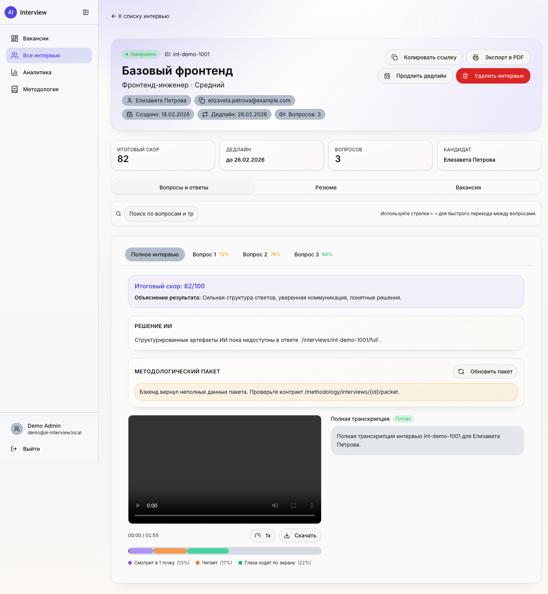

Страница интервью глазами рекрутера: итоговый скор, объяснение результата, транскрипция, видеозапись и таймлайн честности — сколько кандидат смотрел в одну точку, читал и водил глазами по экрану.

---

> 📅 **Хронология.** Начался в **ноябре 2025** как курсовой проект на ФКН ВШЭ, завершён в **апреле 2026**. С апреля по **начало июня 2026** проходил **пилотное тестирование в HR-отделе Сбербанка**. Сейчас команда развивает его **самостоятельно как собственный продукт**. Подробнее — в разделе [«Как появился проект»](#-как-появился-проект).

## 📋 Содержание

[Проблема](#-проблема) · [Идея](#-идея) · [Как появился проект](#-как-появился-проект) · [Как это работает](#-как-это-работает) · [Архитектура](#️-архитектура) · [Сервис пользователей](#-сервис-пользователей-gateway--data-service) · [LLM-сервис](#-llm-сервис-вопросы-и-оценка) · [Сервис взгляда](#️-сервис-взгляда-детекция-списывания) · [Модель данных](#️-модель-данных) · [Результаты пилота](#-результаты-пилота) · [Интерфейс](#️-интерфейс) · [Стек](#-стек) · [Команда](#-команда) · [Лицензия](#-лицензия)

---

## 🎯 Проблема

Первичный технический скрининг — самая дорогая и плохо масштабируемая часть найма. Одно телефонное интервью занимает у HR-специалиста **45–60 минут** с учётом подготовки, проведения и оформления, а один рекрутер физически проводит **не больше 8–10 интервью в день**. При этом бо́льшая часть кандидатов отсеивается именно на первом этапе — то есть самый узкий ресурс тратится на самые типовые вопросы.

Дистанционный формат добавляет вторую проблему — **честность**. На удалённом интервью кандидат может читать ответы с другого экрана, и оценка перестаёт отражать его реальные знания.

## 💡 Идея

Отдать первичный скрининг системе, которая делает ровно то же, что делает рекрутер на созвоне, но асинхронно и параллельно:

1. **Читает вакансию и резюме** — вытягивает текст из PDF и приводит к строгим схемам.
2. **Задаёт персональные вопросы** — LLM генерирует набор устных вопросов под конкретную пару «вакансия × кандидат», с адаптацией сложности под уровень (Junior / Middle / Senior / Lead).
3. **Принимает видеоответы прямо в браузере** — без установки софта, через MediaRecorder API.
4. **Расшифровывает и оценивает** — речь превращается в текст, каждый ответ получает балл, вердикт и развёрнутый комментарий, а интервью — итоговую рекомендацию *hire / hold / reject*.
5. **Следит за честностью** — параллельно работает сервис компьютерного зрения, который по движению взгляда отделяет чтение с экрана от нормального поведения и размечает подозрительные интервалы.

Рекрутеру остаётся не провести интервью, а **прочитать готовый отчёт** — на это уходит 8–12 минут вместо часа.

## 🏆 Как появился проект

Проект начинался как **курсовая работа на факультете компьютерных наук ВШЭ** в ноябре 2025 года. По условиям задания требовалось сделать сравнительно скромную вещь — **агентную систему и «чекап» подглядываний** (детекцию списывания). Но работать над этим оказалось интересно, и вместо минимального прототипа команда собрала полноценную платформу: пять сервисов, микросервисную архитектуру, версионирование наборов вопросов, методологический контур оценки, антифрод и observability — значительно больше, чем требовалось.

Руководителем проекта со стороны индустрии выступила **Смоленцева Таисия Юрьевна, руководитель направления ПАО Сбербанк**. С апреля по начало июня 2026 система прошла **пилотное тестирование в HR-отделе Сбербанка** — на реальных вакансиях и кандидатах, с обратной связью от 14 рекрутеров ([результаты пилота ниже](#-результаты-пилота)).

Сейчас, после завершения академической части, команда развивает AI Interview **как собственный продукт** — с прицелом на большее влияние на процесс найма, а не только на прохождение учебного курса.

## 🔄 Как это работает

Два независимых сценария сходятся в одном интервью — публичный кандидатский и защищённый рекрутерский.

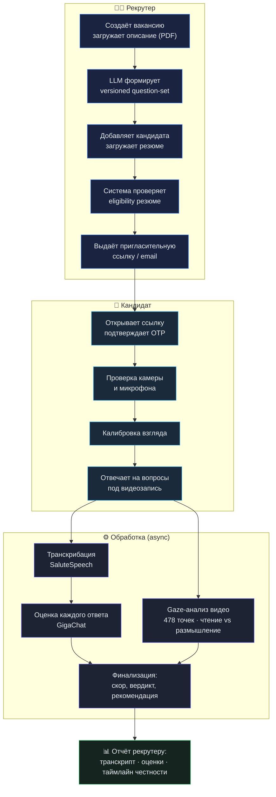

Ключевая архитектурная деталь: интервью не генерируется «с нуля» в момент прохождения. Сначала для вакансии **асинхронно собирается и версионируется** набор вопросов (`vacancy question-set`), и только потом, при создании интервью, готовый набор копируется в конкретную сессию. Это делает выдачу интервью быстрой и воспроизводимой, а сам тяжёлый LLM-вызов уводит в фон.

## 🏗️ Архитектура

Пять сервисов, каждый со своей зоной ответственности. Браузер общается **только с gateway** — прямого доступа к data-service, LLM-сервису, сервису взгляда и объектному хранилищу снаружи нет.

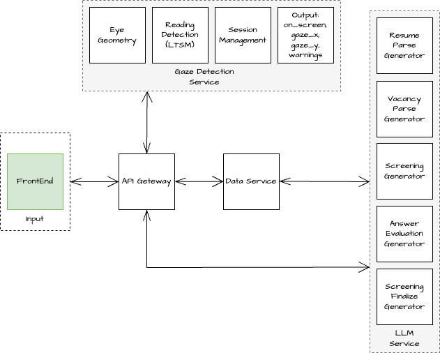

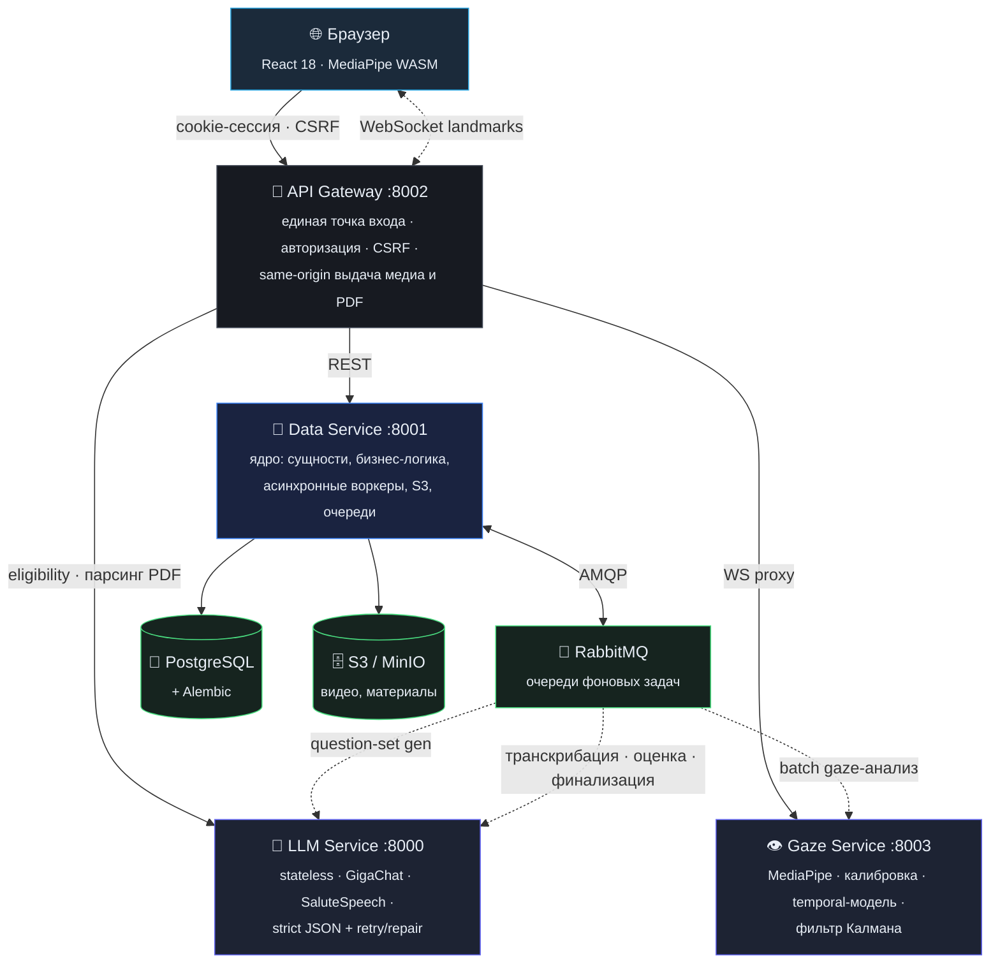

Всё поднимается через Docker Compose, сервисы общаются во внутренней сети `agent-hr-network`, наружу открыты только gateway и фронтенд. Каждый сервис отдаёт метрики Prometheus и трейсы OpenTelemetry; сквозной `X-Correlation-ID` и `traceparent` протягиваются через все вызовы.

**Почему разделено на gateway и data-service.** Gateway — тонкий stateless-слой, который адаптирует браузерный трафик к внутренним сервисам: cookie-сессии, CSRF, same-origin выдача медиа и PDF, security headers. Data-service — системное ядро: сущности, бизнес-логика, S3, очереди и асинхронные воркеры. Такое разделение выносит всё «браузерное» из ядра и оставляет data-service чистым носителем данных и оркестратором фоновых задач.

## 👥 Сервис пользователей (Gateway + Data Service)

### API Gateway

Единственная внешняя точка входа. Не хранит бизнес-данные — адаптирует запросы браузера к внутренним сервисам:

- **Два режима авторизации.** Для браузера — cookie-сессия (`access_token` + `refresh_token`), маршруты `/auth/login`, `/auth/refresh`, `/auth/logout`, `/auth/csrf` и OIDC SSO. Для автоматизированных клиентов — персональные API-ключи: gateway разрешает ключ через data-service и выпускает краткоживущий внутренний JWT, чтобы downstream-роуты работали по единому контракту.
- **CSRF и CORS.** Для всех mutating cookie-запросов проверяются `csrf_token` cookie, заголовок `X-CSRF-Token` и `Origin/Referer`.
- **Безопасный публичный контур.** Маршруты `/vacancy/public/*` для отклика кандидата, OTP-подтверждения и антифрод-precheck перед созданием интервью.
- **Same-origin доступ к медиа.** Вместо раскрытия прямого S3-URL система отдаёт путь `/media/{object_key}`, который читается через gateway. Загрузка интервью поддерживается и целиком, и по чанкам.
- **Доменные роуты вместо универсального прокси** — auth, vacancy, interview, storage, export, methodology, — чтобы встроить в gateway специфическую проверку доступа и нормализацию.

### Data Service

Центральный backend-компонент — реляционное хранилище, бизнес-логика, интеграции, объектное хранилище и асинхронные воркеры в одном сервисе. Хранение разделено на три уровня: **PostgreSQL** для сущностей и состояний, **S3/MinIO** для бинарных объектов, **RabbitMQ** для очередей фоновых задач.

Именно здесь живут долгие операции — воркеры транскрибации, оценки ответов, финализации, gaze-анализа и генерации question-set. Data-service не просто CRUD-хранилище: он держит `tenant`-изоляцию, роли (`platform_admin` / `admin` / `recruiter` / `viewer`), идемпотентность upload-операций и методологический контур оценки с аудитом.

**Безопасность** распределена между слоями: cookie-auth и refresh-flow, CSRF на mutating-запросах, персональные API-ключи (hash+prefix в БД), внутренний `X-Internal-Service-Token` для `/internal/*`, OTP и rate-limiting на публичном контуре, и fail-fast проверка секретов — сервис не стартует в production с дефолтными ключами.

## 🧠 LLM-сервис (вопросы и оценка)

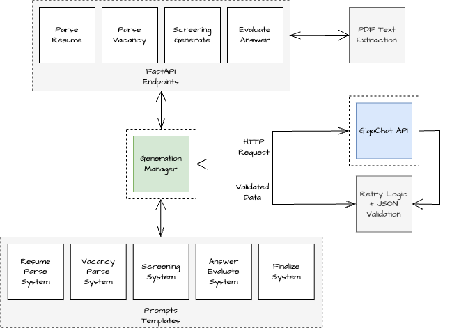

Stateless-сервис поверх **GigaChat** и **SaluteSpeech**: без собственной БД и очередей, он синхронно вызывает модель, валидирует structured output и возвращает строгий JSON. Своё состояние и повторы держит data-service — LLM остаётся чистым вычислительным узлом.

| Endpoint | Задача |
|---|---|
| `/resume/extract` · `/resume/parse` | Текст из PDF резюме → схема `Resume` |
| `/vacancy/extract` · `/vacancy/parse` | Текст из PDF вакансии → схема `Vacancy` (с partial-output и `missing_fields`) |
| `/screening/generate` | Набор устных вопросов под пару «вакансия × резюме», 1–30 шт., `ru`/`en` |
| `/evaluation/resume` | Eligibility: `match_score` 0–10, порог допуска ≥ 5 |
| `/screening/evaluate_answer` | Оценка ответа: score, verdict (`correct`/`partially_correct`/`incorrect`), комментарий, `missing_points`, `improvement_advice` |
| `/screening/finalize` | Итог: summary, evidence, risk, рекомендация + downstream-артефакты |
| `/speech/recognize` | Аудиофрагмент → текст (SaluteSpeech) |

**Контроль качества JSON — главная инженерная работа сервиса.** Модель не всегда возвращает валидный structured output, поэтому вокруг генерации построен `GenerationManager`: единый запуск генераторов, извлечение и безопасная сериализация ответа, валидация по Pydantic-схемам, повторы с экспоненциальной задержкой и — для финализации — режим **schema-guided repair** (`sgr`), когда сервис чинит невалидный JSON дополнительными попытками и лишь затем прибегает к детерминированному fallback.

**Оценка — не только LLM.** Итоговый `overall_score` data-service пересчитывает сам по сохранённым оценкам ответов, нормализует конфликт между текстовой рекомендацией модели и формульным вердиктом, строит auto-scorecard и обновляет методологический packet. Короткие ответы вида «не знаю» отлавливаются воркером детерминированно, без обращения к модели. Так текст модели не становится единственным источником истины по кандидату.

**Речь → текст в общем пайплайне.** Видео интервью достаётся из S3, `ffmpeg` нарезает поответные аудиосегменты (при необходимости деля их по паузам), каждый подфрагмент уходит в `/speech/recognize`, а собранный текст ложится в `answers.transcript`.

## 👁️ Сервис взгляда (детекция списывания)

Самая исследовательская часть проекта — отдельный сервис на FastAPI (:8003), который по видео интервью отличает **чтение с экрана** от нормального поведения. Это двухэтапный ML-пайплайн.

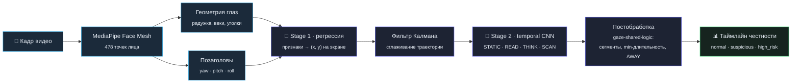

**Stage 1 — куда смотрит кандидат.** MediaPipe Face Mesh даёт 478 точек лица; из точек радужки (468–473), век и уголков глаз извлекаются геометрические признаки, к ним добавляются углы поворота головы. Регрессионная модель переводит это в координату `(x, y)` на экране. Точность калибруется под каждого пользователя: перед интервью кандидат смотрит на серию точек, система собирает признаки и обучает **персональную модель** (экспорт в ONNX). В обучении, помимо основной ошибки по координате, используется **delta-loss** — штраф за расхождение изменения координат между соседними кадрами, что делает модель чувствительной к микросмещениям взгляда, а не только к крупным переходам.

**Фильтр Калмана — сглаживание.** Детекция MediaPipe шумит и дрожит. Взгляд моделируется состоянием `[x, ẋ, y, ẏ]` (постоянная скорость), а фильтр Калмана с `measurement_noise ≫ process_noise` подавляет дрожание, сохраняя способность отслеживать реальные движения. Формально это оценка состояния линейной динамической системы по зашумлённым наблюдениям — ровно та задача, под которую фильтр и создан.

**Stage 2 — что делает кандидат.** По временно́му окну признаков модель классифицирует поведение на `STATIC`, `READ`, `THINK`, `SCAN`. Изначально пробовали LSTM, но она слишком быстро забывала контекст на длинных последовательностях — в итоге выбрана **temporal-архитектура со свёртками**, которая устойчивее ловит локальные паттерны движения глаз (саккады, фиксации, регрессии, линейность чтения). Отдельно рассчитывается флаг `AWAY` — долгий увод взгляда за экран.

**Постобработка снимает ложные срабатывания.** Модуль `gaze-shared-logic` превращает шумные покадровые вероятности в устойчивые сегменты: близкие классы объединяются (`STATIC`→`FIXED`, `THINK`+`SCAN`→`SCAN`), применяется временна́я фильтрация и минимальная длительность сегмента, так что одиночные всплески от морганий и случайных движений не становятся «подозрительным поведением».

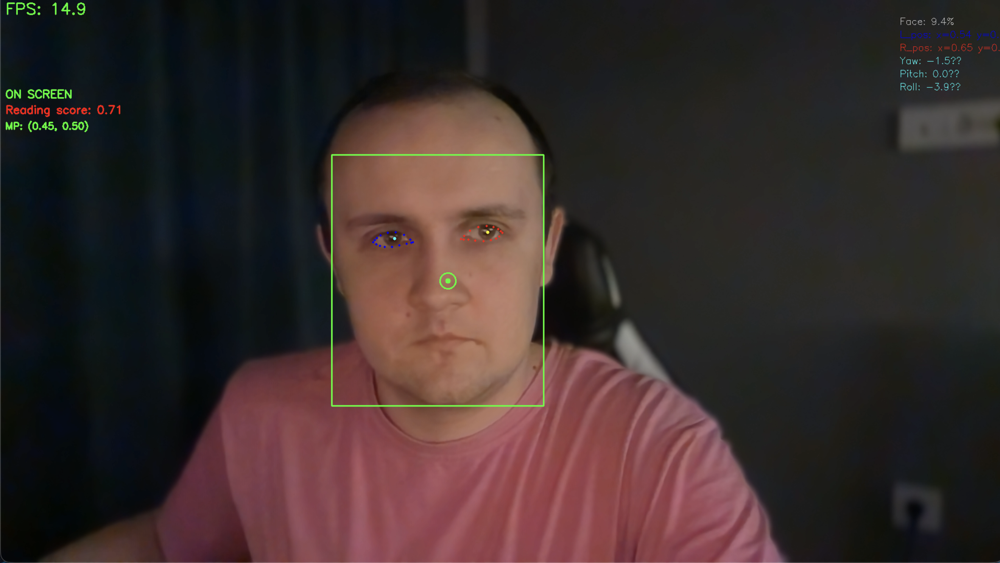

На выходе — аннотированное видео (точки лица, траектория взгляда последних 30 кадров, предупреждения `OFF-SCREEN` / `READING DETECTED`) и JSON-отчёт с процентом времени on-/off-screen, числом переходов, детекциями чтения и итоговым вердиктом. Результат встраивается в общий антифрод-таймлайн интервью — тот самый, что виден рекрутеру под видеоплеером.

## 🗄️ Модель данных

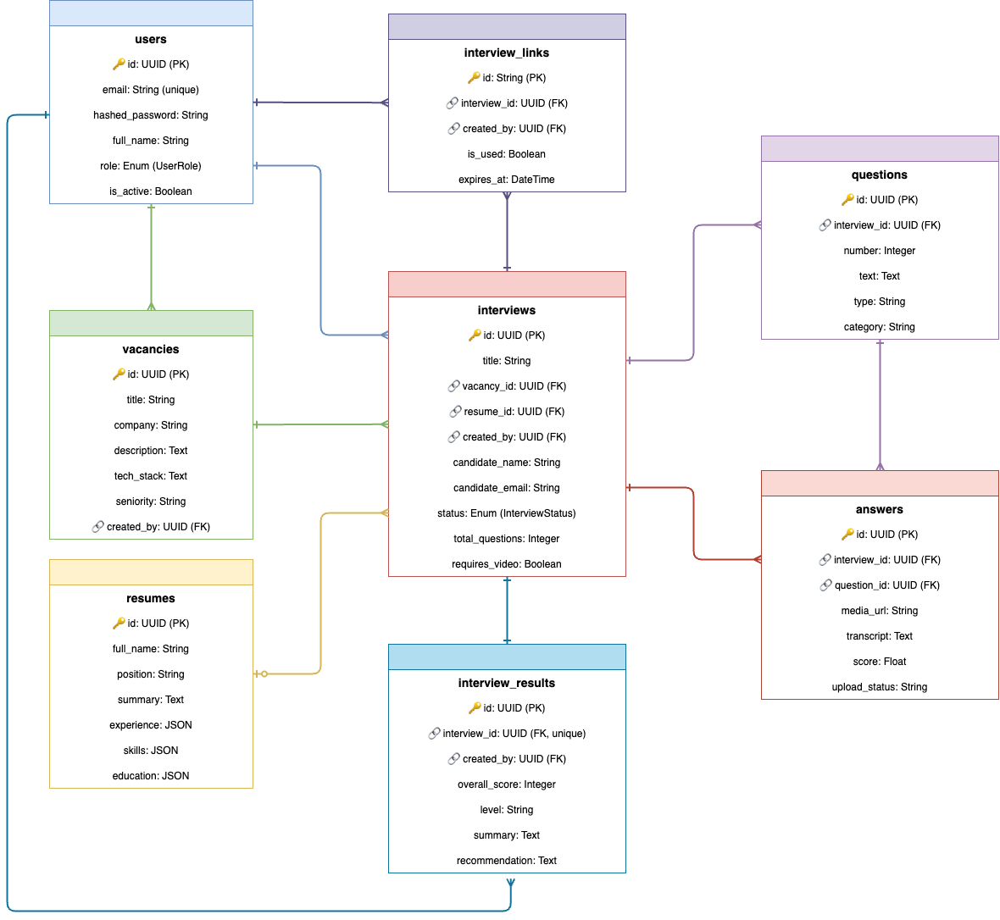

Таблицы PostgreSQL сгруппированы по доменам:

- **Идентичность и доступы** — `users`, `tenants`, `refresh_sessions`, `user_api_keys`, `otp_codes`: роли, tenant-изоляция, refresh-flow, персональные ключи.
- **Вакансии** — `vacancies`, `vacancy_materials`, `vacancy_generation_jobs`, `vacancy_question_sets`: описание, исходные материалы, статусы асинхронной генерации и **версионированные** наборы вопросов.
- **Интервью** — `resumes`, `interviews`, `interview_links`, `questions`, `answers`, `interview_recordings`, `interview_results`: с operational-полями `question_generation_status`, `question_set_version`, `evaluation_status`, `reset_attempts`, `expires_at`.
- **Методология и аудит** — `role_profiles`, `question_bank_items`, `rubrics`, `interview_scorecards`, `interview_packets`, `interview_debriefs`, `methodology_audit_events`: формализованный слой оценки и аудита решений.

`tenant_id` присутствует в большинстве доменных таблиц — доступ определяется не только ролью, но и принадлежностью к tenant'у, владельцу вакансии/интервью и правилом visibility.

## 📊 Результаты пилота

Метрики по итогам опытной эксплуатации в HR-отделе Сбербанка (апрель–июнь 2026):

| Метрика | Результат |
|---|---|
| ⏱️ **Сокращение времени скрининга** | −78% на кандидата (8–12 мин вместо 45–60) |
| ⚡ **Time-to-feedback** | < 15 минут вместо 2–5 рабочих дней |
| 🎯 **Конкордантность с экспертом** | 82% совпадений (±1 балл из 10) на выборке 48 ответов |
| 📝 **Релевантность вопросов** | 89% соответствуют требованиям вакансии; 94% корректно адаптированы под уровень |
| 👁️ **Точность детекции списывания** | 86% на 35 смоделированных сессиях, FPR 11% |
| ✅ **Completion rate** | 74% (уровень отрасли для асинхронных видеоинтервью) |
| 💰 **Стоимость обработки** | 12–18 ₽ на интервью из 7–10 вопросов |
| 📈 **ROI при 500 интервью/мес** | высвобождение ~290–320 человеко-часов (1,5–2 FTE на скрининге) |

**Качество моделей взгляда:** Stage 1 (регрессия координат) — MAE_x = 0.054, MAE_y = 0.128; Stage 2 (классификация поведения) — **F1 = 0.9215**.

**Оценка рекрутеров** (опрос 14 участников пилота): 86% оценили удобство создания интервью как «высокое»/«очень высокое», 79% отметили, что качество вопросов соответствует их стандарту или превышает его, 93% готовы использовать систему в работе.

## 🖥️ Интерфейс

SPA на React 18 + TypeScript, разделённое на публичную (кандидат) и защищённую (рекрутер) части.

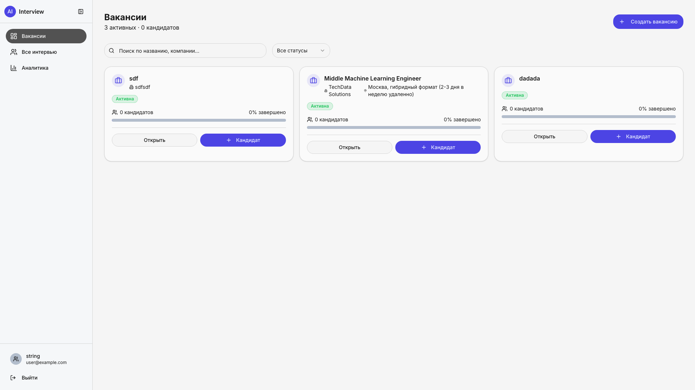
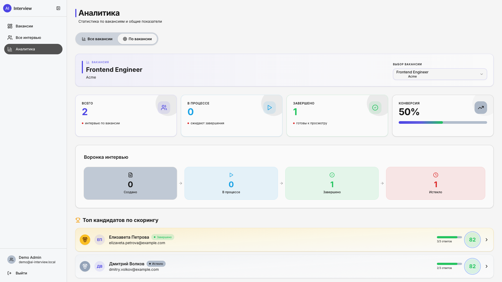
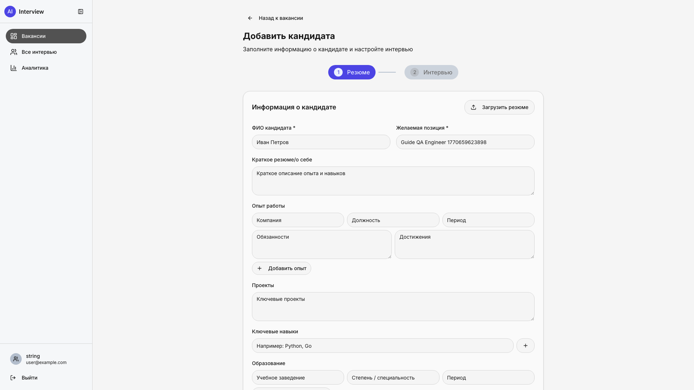
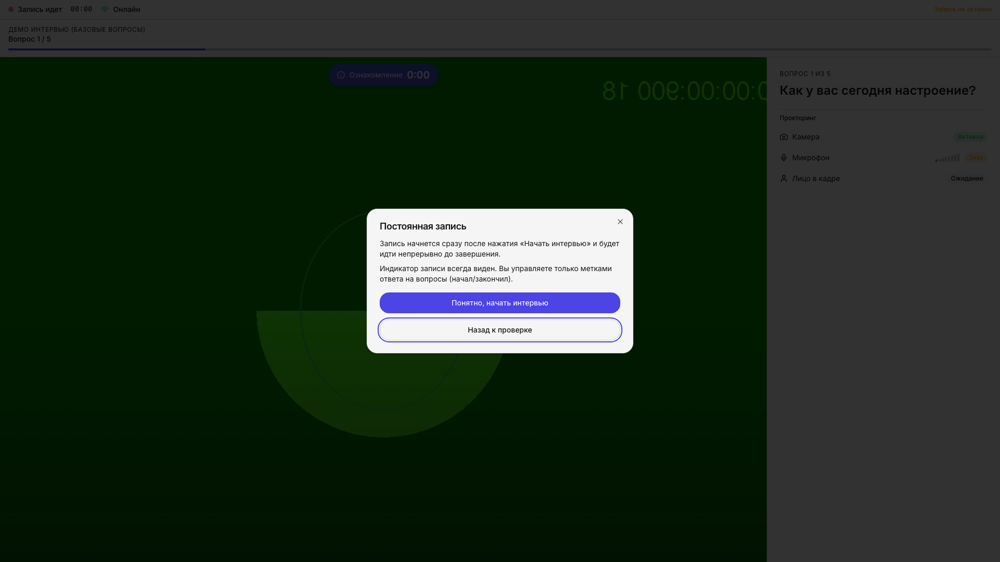

- **Кабинет рекрутера** — вакансии со статистикой, создание вакансии с загрузкой PDF, добавление кандидата (резюме парсится, вопросы генерируются, выдаётся ссылка), детальная страница интервью с оценками и видео, аналитика-воронка.
- **Кандидатский сценарий** — приветствие и согласие на запись, проверка оборудования, калибровка взгляда, прохождение интервью с записью видео/аудио прямо в браузере (MediaRecorder API), таймером и прогрессом.
- **Технологии интерфейса** — Vite, React Router, TanStack Query (кеш и ревалидация серверного состояния), Tailwind CSS + shadcn/ui на Radix.

## 🧰 Стек

**Backend** FastAPI (4 сервиса) · PostgreSQL + SQLAlchemy + Alembic · RabbitMQ (aio-pika) · S3/MinIO (boto3) · APScheduler · httpx
**AI / ML** GigaChat · SaluteSpeech · LangChain · MediaPipe Face Mesh (478 точек) · CatBoost · PyTorch (temporal CNN) · pykalman · OpenCV · ONNX
**Frontend** React 18 · TypeScript · Vite · React Router · TanStack Query · Tailwind CSS · shadcn/ui (Radix)
**Инфраструктура** Docker Compose · nginx · Prometheus · OpenTelemetry · GitLab CI · git submodules (meta-repo)

## 👤 Команда

Проект — работа троих студентов ФКН ВШЭ (образовательная программа «Прикладная математика и информатика»).

| | Роль |
|---|---|
| **Семён Колчин** · [@simeonkolchin](https://github.com/simeonkolchin) | Архитектура системы, весь backend: API Gateway, Data Service, LLM-сервис. Интеграция GigaChat и SaluteSpeech, система промптов и retry/repair-логика. Вся DevOps-инфраструктура, Docker Compose, деплой. Управление проектом. |
| **Дмитрий Куценко** · [@kdimon15](https://github.com/kdimon15) | Сервис детекции взгляда с нуля: пайплайн обработки видео, интеграция MediaPipe, обучение моделей калибровки и детекции поведения, фильтр Калмана, визуализация и отчётность. |
| **Вячеслав Гуч** · [@Slavikss](https://github.com/Slavikss) | Фронтенд на React + TypeScript: интерфейсы рекрутера и кандидата, запись видео/аудио в браузере, проверка оборудования, интеграция с backend. |

Руководитель проекта: **Смоленцева Таисия Юрьевна**, руководитель направления, ПАО Сбербанк.

## 📄 Лицензия

**Проприетарная, все права защищены** — см. [LICENSE](LICENSE).

Репозиторий выложен как **source-available** для ознакомления и оценки работы (портфолио, потенциальные партнёры и работодатели). Это **не open-source**: копирование, использование в других проектах, создание производных или похожих систем на основе этого кода, архитектуры или методологии — запрещены без письменного разрешения авторов. Авторы сохраняют полное право развивать проект дальше своей командой. По вопросам лицензирования — [@simeon_kolchin](https://t.me/simeon_kolchin).
