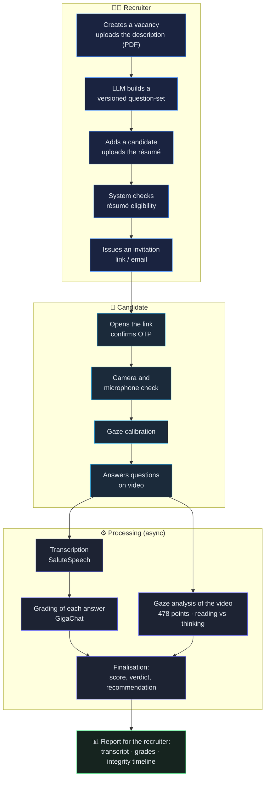
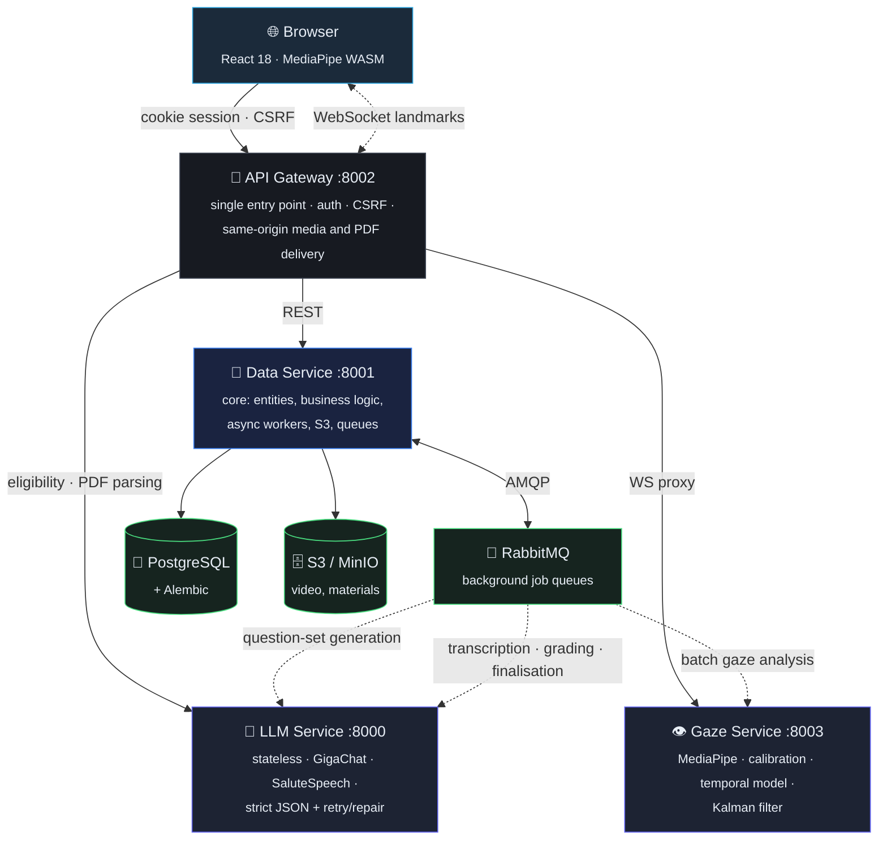
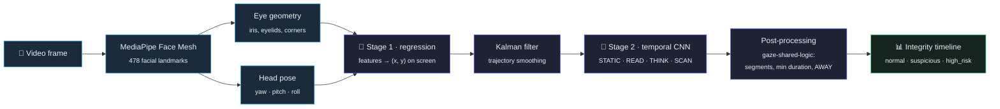
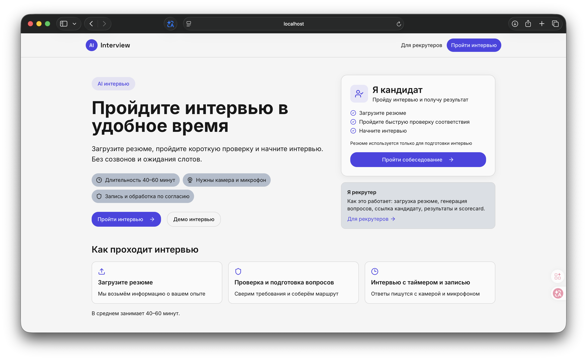
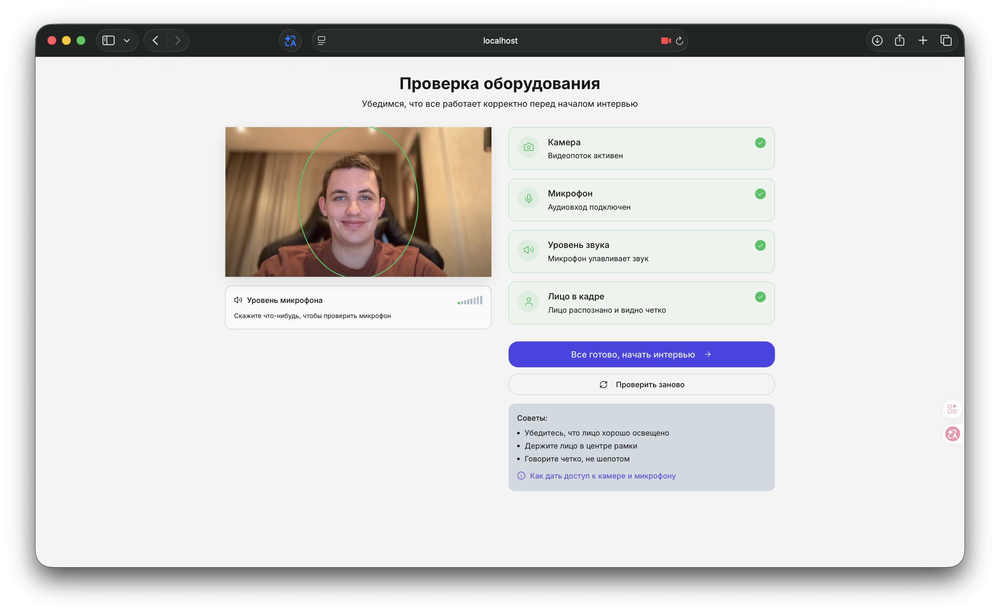
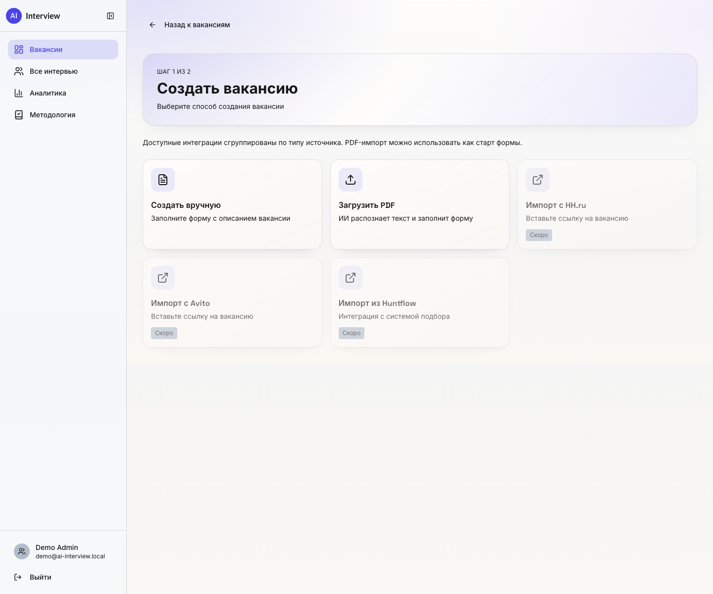

# 🤖 AI Interview — automated technical interview platform

**A candidate applies through a link, answers personalised questions on camera, and the recruiter receives a finished report: transcript, a graded verdict for every answer, a final recommendation, and an integrity timeline built from eye movement — without a single live call.**

Questions are generated by an LLM for the specific *vacancy × résumé* pair. Answers are transcribed by a speech engine and graded by the same model. Integrity is enforced by a separate computer-vision service that tells reading-off-screen apart from thinking, using 478 facial landmarks.

The interview page as the recruiter sees it: overall score, an explanation of the result, transcript, video recording and an integrity timeline — how long the candidate stared at one point, read, and scanned the screen.

**🔗 Live product: [ai-interview.space](https://ai-interview.space)**

---

> 📅 **Timeline.** Started in **November 2025** as a university project at the HSE Faculty of Computer Science, completed in **April 2026**. From April to **early June 2026** it ran a **pilot in the HR department of Sberbank**. The team is now developing it **independently, as its own product**. More in [How this project happened](#-how-this-project-happened).

---

## 🎬 Demo

The candidate takes the interview straight in the browser — questions are generated from their résumé and the vacancy, answers are recorded on video, and a computer-vision service keeps the face in frame and tracks gaze across 478 landmarks in real time.

Desktop: live camera preview with face tracking, the proctor panel (camera · microphone · face in frame), a personalised question and the timer.

  

The same on a phone — nothing to install, recording runs through the MediaRecorder API right in the mobile browser.

**📺 Full demo** — three recordings of the complete flow (recruiter, candidate, mobile):
[Google Drive](https://drive.google.com/drive/folders/174rOTI-VNa3e0xOSok07XKPzixmhS6gU) · [GitHub Release](https://github.com/simeonkolchin/ai-interview/releases/tag/demo). Live product: **[ai-interview.space](https://ai-interview.space)**.

## 📋 Contents

[Demo](#-demo) · [The problem](#-the-problem) · [The idea](#-the-idea) · [How this project happened](#-how-this-project-happened) · [How it works](#-how-it-works) · [Architecture](#️-architecture) · [User services](#-user-services-gateway--data-service) · [LLM service](#-llm-service-questions-and-grading) · [Gaze service](#️-gaze-service-cheating-detection) · [Data model](#️-data-model) · [Pilot results](#-pilot-results) · [Interface](#️-interface) · [Stack](#-stack) · [Team](#-team) · [License](#-license)

---

## 🎯 The problem

First-round technical screening is the most expensive and least scalable part of hiring. A single phone interview costs an HR specialist **45–60 minutes** once preparation, the call itself and the write-up are counted, and one recruiter physically manages **no more than 8–10 interviews a day**. Yet most candidates are filtered out at exactly this first stage — meaning the scarcest resource is spent on the most repetitive questions.

Remote formats add a second problem: **integrity**. In a remote interview a candidate can read answers off another screen, and the assessment stops reflecting what they actually know.

## 💡 The idea

Hand first-round screening to a system that does what a recruiter does on a call, but asynchronously and in parallel:

1. **Reads the vacancy and the résumé** — extracts text from PDFs and normalises it into strict schemas.
2. **Asks personalised questions** — an LLM generates a set of spoken questions for the specific *vacancy × candidate* pair, with difficulty adapted to seniority (Junior / Middle / Senior / Lead).
3. **Accepts video answers in the browser** — no software to install, via the MediaRecorder API.
4. **Transcribes and grades** — speech becomes text, every answer gets a score, a verdict and a written comment, and the interview gets a final *hire / hold / reject* recommendation.
5. **Watches for integrity** — a computer-vision service runs alongside, separating reading-off-screen from normal behaviour and marking suspicious intervals.

The recruiter no longer runs an interview — they **read a finished report**, which takes 8–12 minutes instead of an hour.

## 🏆 How this project happened

The project began as **coursework at the HSE Faculty of Computer Science** in November 2025. The assignment asked for something fairly modest — an **agent system and a "check-up" for peeking** (cheating detection). But the work turned out to be genuinely interesting, and instead of a minimal prototype the team built a full platform: five services, a microservice architecture, versioned question sets, a formal assessment methodology layer, anti-fraud and observability — considerably more than was required.

The industry supervisor was **Taisiya Yurievna Smolentseva, Head of Department at Sberbank**. From April to early June 2026 the system ran a **pilot in Sberbank's HR department** — on real vacancies and real candidates, with feedback from 14 recruiters ([pilot results below](#-pilot-results)).

With the academic part finished, the team now develops AI Interview **as its own product**, aiming at real impact on hiring rather than at passing a course.

## 🔄 How it works

Two independent flows converge on a single interview — the public candidate one and the protected recruiter one.

A key architectural detail: an interview is not generated from scratch at the moment it is taken. A question set is **assembled and versioned asynchronously** for the vacancy first (`vacancy question-set`), and only then, when an interview is created, is the ready set copied into that session. This makes issuing an interview fast and reproducible, and moves the heavy LLM call into the background.

## 🏗️ Architecture

Five services, each with its own area of responsibility. The browser talks **only to the gateway** — there is no external access to the data service, the LLM service, the gaze service or object storage.

Everything runs under Docker Compose; services talk over the internal `agent-hr-network`, and only the gateway and the frontend are exposed. Every service emits Prometheus metrics and OpenTelemetry traces, with an end-to-end `X-Correlation-ID` and `traceparent` threaded through all calls.

**Why gateway and data service are separate.** The gateway is a thin stateless layer adapting browser traffic to internal services: cookie sessions, CSRF, same-origin media and PDF delivery, security headers. The data service is the system core: entities, business logic, S3, queues and async workers. The split keeps everything "browser-shaped" out of the core and leaves the data service a clean owner of data and background orchestration.

## 👥 User services (Gateway + Data Service)

### API Gateway

The only external entry point. It stores no business data — it adapts browser requests to internal services:

- **Two auth modes.** For browsers, cookie sessions (`access_token` + `refresh_token`) with `/auth/login`, `/auth/refresh`, `/auth/logout`, `/auth/csrf` and OIDC SSO. For automated clients, personal API keys: the gateway resolves the key through the data service and issues a short-lived internal JWT so downstream routes keep a single contract.
- **CSRF and CORS.** Every mutating cookie request is checked against the `csrf_token` cookie, the `X-CSRF-Token` header and `Origin`/`Referer`.
- **A safe public surface.** Routes under `/vacancy/public/*` for candidate applications, OTP confirmation and an anti-fraud precheck before an interview is created.
- **Same-origin media access.** Instead of exposing a direct S3 URL, the system serves `/media/{object_key}` read through the gateway. Interview upload supports both whole-file and chunked transfer.
- **Domain routes instead of a generic proxy** — auth, vacancy, interview, storage, export, methodology — so access checks and normalisation specific to each domain live in the gateway.

### Data Service

The central backend component — relational storage, business logic, integrations, object storage and async workers in one service. Storage is split three ways: **PostgreSQL** for entities and state, **S3/MinIO** for binary objects, **RabbitMQ** for background job queues.

This is where the long operations live: workers for transcription, answer grading, finalisation, gaze analysis and question-set generation. The data service is more than CRUD storage — it owns `tenant` isolation, roles (`platform_admin` / `admin` / `recruiter` / `viewer`), idempotent uploads, and the assessment-methodology layer with its audit trail.

**Security** is distributed across the layers: cookie auth and refresh flow, CSRF on mutating requests, personal API keys (hash + prefix in the database), an internal `X-Internal-Service-Token` for `/internal/*`, OTP and rate limiting on the public surface, and a fail-fast secret check — the service refuses to start in production with default keys.

## 🧠 LLM service (questions and grading)

A stateless service over **GigaChat** and **SaluteSpeech**: with no database or queues of its own, it calls the model synchronously, validates structured output and returns strict JSON. State and retries belong to the data service — the LLM stays a pure compute node.

| Endpoint | Purpose |
|---|---|
| `/resume/extract` · `/resume/parse` | Text from a résumé PDF → `Resume` schema |
| `/vacancy/extract` · `/vacancy/parse` | Text from a vacancy PDF → `Vacancy` schema (with partial output and `missing_fields`) |
| `/screening/generate` | A set of spoken questions for the *vacancy × résumé* pair, 1–30 items, `ru`/`en` |
| `/evaluation/resume` | Eligibility: `match_score` 0–10, admission threshold ≥ 5 |
| `/screening/evaluate_answer` | Answer grading: score, verdict (`correct`/`partially_correct`/`incorrect`), comment, `missing_points`, `improvement_advice` |
| `/screening/finalize` | Outcome: summary, evidence, risk, recommendation + downstream artefacts |
| `/speech/recognize` | Audio fragment → text (SaluteSpeech) |

**Keeping the JSON valid is the service's main engineering problem.** The model does not always return valid structured output, so generation is wrapped in a `GenerationManager`: a single entry point for generators, extraction and safe serialisation of the response, validation against Pydantic schemas, retries with exponential backoff and — for finalisation — a **schema-guided repair** mode (`sgr`), where the service repairs invalid JSON through extra attempts before falling back to a deterministic result.

**Grading is not only the LLM.** The data service recomputes the final `overall_score` itself from the stored answer grades, reconciles conflicts between the model's prose recommendation and the formulaic verdict, builds an auto-scorecard and updates the methodology packet. Non-answers such as "I don't know" are caught deterministically by a worker, without calling the model at all. That keeps the model's text from being the single source of truth about a candidate.

**Speech-to-text sits in the same pipeline.** The interview video is pulled from S3, `ffmpeg` cuts per-answer audio segments (splitting them further on pauses when needed), each sub-fragment goes to `/speech/recognize`, and the assembled text lands in `answers.transcript`.

## 👁️ Gaze service (cheating detection)

The most research-heavy part of the project — a separate FastAPI service (:8003) that tells **reading off a screen** apart from normal behaviour, from the interview video. It is a two-stage ML pipeline.

**Stage 1 — where the candidate is looking.** MediaPipe Face Mesh yields 478 facial landmarks; geometric features are extracted from the iris points (468–473), the eyelids and the eye corners, and head rotation angles are added. A regression model turns those into an `(x, y)` coordinate on the screen. Accuracy is calibrated per person: before the interview the candidate looks at a series of points, the system collects features and trains a **personal model** (exported to ONNX). Beyond the main coordinate error, training uses a **delta loss** — a penalty on the discrepancy in coordinate *change* between adjacent frames, which makes the model sensitive to micro-shifts of gaze rather than only to large jumps.

**The Kalman filter — smoothing.** MediaPipe detection is noisy and jittery. Gaze is modelled as a state `[x, ẋ, y, ẏ]` (constant velocity), and a Kalman filter with `measurement_noise ≫ process_noise` suppresses the jitter while still tracking genuine movement. Formally this is state estimation of a linear dynamical system from noisy observations — precisely the problem the filter was designed for.

**Stage 2 — what the candidate is doing.** Over a temporal window of features, a model classifies behaviour into `STATIC`, `READ`, `THINK`, `SCAN`. An LSTM was tried first but forgot context too quickly on long sequences; the final choice is a **temporal convolutional architecture**, which captures local eye-movement patterns (saccades, fixations, regressions, the linearity of reading) more robustly. An `AWAY` flag — a prolonged look away from the screen — is computed separately.

**Post-processing removes false positives.** The `gaze-shared-logic` module turns noisy per-frame probabilities into stable segments: neighbouring classes are merged (`STATIC`→`FIXED`, `THINK`+`SCAN`→`SCAN`), temporal filtering and a minimum segment duration are applied, so isolated spikes from blinks and stray movements never become "suspicious behaviour".

The output is an annotated video (facial landmarks, the gaze trajectory of the last 30 frames, `OFF-SCREEN` / `READING DETECTED` warnings) plus a JSON report with the share of on-/off-screen time, the number of transitions, reading detections and a final verdict. The result feeds the interview's overall anti-fraud timeline — the one the recruiter sees under the video player.

## 🗄️ Data model

The PostgreSQL tables are grouped by domain:

- **Identity and access** — `users`, `tenants`, `refresh_sessions`, `user_api_keys`, `otp_codes`: roles, tenant isolation, refresh flow, personal keys.
- **Vacancies** — `vacancies`, `vacancy_materials`, `vacancy_generation_jobs`, `vacancy_question_sets`: descriptions, source materials, async generation status and **versioned** question sets.
- **Interviews** — `resumes`, `interviews`, `interview_links`, `questions`, `answers`, `interview_recordings`, `interview_results`, with operational fields such as `question_generation_status`, `question_set_version`, `evaluation_status`, `reset_attempts`, `expires_at`.
- **Methodology and audit** — `role_profiles`, `question_bank_items`, `rubrics`, `interview_scorecards`, `interview_packets`, `interview_debriefs`, `methodology_audit_events`: the formalised assessment layer and the audit trail behind decisions.

`tenant_id` is present on most domain tables — access is decided not only by role but also by tenant membership, ownership of the vacancy/interview and a visibility rule.

## 📊 Pilot results

Metrics from the trial run in Sberbank's HR department (April–June 2026):

| Metric | Result |
|---|---|
| ⏱️ **Screening time reduction** | −78% per candidate (8–12 min instead of 45–60) |
| ⚡ **Time-to-feedback** | < 15 minutes instead of 2–5 business days |
| 🎯 **Concordance with a human expert** | 82% agreement (±1 point out of 10) on a sample of 48 answers |
| 📝 **Question relevance** | 89% match the vacancy requirements; 94% correctly adapted to seniority |
| 👁️ **Cheating-detection accuracy** | 86% across 35 simulated sessions, FPR 11% |
| ✅ **Completion rate** | 74% (industry level for asynchronous video interviews) |
| 💰 **Processing cost** | ₽12–18 per interview of 7–10 questions |
| 📈 **ROI at 500 interviews/month** | ~290–320 person-hours freed (1.5–2 FTE of screening) |

**Gaze model quality:** Stage 1 (coordinate regression) — MAE_x = 0.054, MAE_y = 0.128; Stage 2 (behaviour classification) — **F1 = 0.9215**.

**Recruiter feedback** (survey of 14 pilot participants): 86% rated the ease of creating an interview as "high"/"very high", 79% said question quality met or exceeded their own standard, and 93% were willing to use the system in their work.

## 🖥️ Interface

A React 18 + TypeScript SPA split into a **public** part (candidate, link access) and a **protected** one (recruiter, authenticated). Below is a step-by-step walkthrough of both flows. Technology: Vite, React Router, TanStack Query (server-state caching and revalidation), Tailwind CSS + shadcn/ui on Radix, media capture via the MediaRecorder API.

### 👤 Candidate flow

**1. Landing.** The candidate arrives through a link and sees the terms (40–60 minutes, camera and microphone required, recording by consent) and the three steps of the process. Nothing to install.

**2. Welcome and consent.** The interview's opening screen: number of questions, expected duration, consent to video recording and data processing.

**3. Equipment check.** Before the start, the system verifies camera, microphone, audio level and the presence of a face in frame — four green ticks and you are ready.

**4. Taking the interview.** The current question, a recording timer, progress across all questions, and a live camera preview with face tracking. The answer is recorded in the browser, with re-recording if needed.

### 🧑‍💼 Recruiter flow

**5. Vacancy dashboard.** A list of vacancies with quick statistics for each — candidate count and status. Vacancies are created and interviews opened from here.

**6. Creating a vacancy.** The recruiter describes the role and optionally uploads a PDF description — the LLM service builds a question bank from it.

**7. Adding a candidate.** A résumé (PDF/DOC) is uploaded — the system parses it through the LLM, generates personalised questions for the *vacancy × résumé* pair and issues a unique invitation link.

**8. Interview report.** Overall score, an explanation of the result, a transcript with a grade for every answer, the video recording with a player, and an integrity timeline built from eye movement. Recommendation: *hire / hold / reject*.

**9. Analytics.** Hiring funnel, stage-by-stage conversion, distribution of candidates by level and top results — to compare candidates quickly and judge the process.

## 🧰 Stack

**Backend** FastAPI (4 services) · PostgreSQL + SQLAlchemy + Alembic · RabbitMQ (aio-pika) · S3/MinIO (boto3) · APScheduler · httpx
**AI / ML** GigaChat · SaluteSpeech · LangChain · MediaPipe Face Mesh (478 landmarks) · CatBoost · PyTorch (temporal CNN) · pykalman · OpenCV · ONNX
**Frontend** React 18 · TypeScript · Vite · React Router · TanStack Query · Tailwind CSS · shadcn/ui (Radix)
**Infrastructure** Docker Compose · nginx · Prometheus · OpenTelemetry · GitLab CI · git submodules (meta-repo)

## 👤 Team

The project is the work of three students at the HSE Faculty of Computer Science (Applied Mathematics and Computer Science programme).

| | Role |
|---|---|
| **Simeon Kolchin** · [@simeonkolchin](https://github.com/simeonkolchin) | System architecture and the whole backend: API Gateway, Data Service, LLM service. GigaChat and SaluteSpeech integration, the prompt system and retry/repair logic. All DevOps infrastructure, Docker Compose, deployment. Project management. |
| **Dmitry Kutsenko** · [@kdimon15](https://github.com/kdimon15) | The gaze detection service from scratch: video processing pipeline, MediaPipe integration, training of the calibration and behaviour models, the Kalman filter, visualisation and reporting. |
| **Vyacheslav Guch** · [@Slavikss](https://github.com/Slavikss) | Frontend in React + TypeScript: recruiter and candidate interfaces, in-browser video/audio recording, equipment checks, backend integration. |

Project supervisor: **Taisiya Yurievna Smolentseva**, Head of Department, Sberbank.

## 📄 License

**Proprietary, all rights reserved** — see [LICENSE](LICENSE).

The repository is published as **source-available** for review and evaluation (portfolio, prospective partners and employers). This is **not open source**: copying, use in other projects, and the creation of derivative or similar systems based on this code, architecture or methodology are prohibited without written permission from the authors. The authors retain the full right to continue developing the project with their own team. For licensing enquiries — [@simeon_kolchin](https://t.me/simeon_kolchin).
