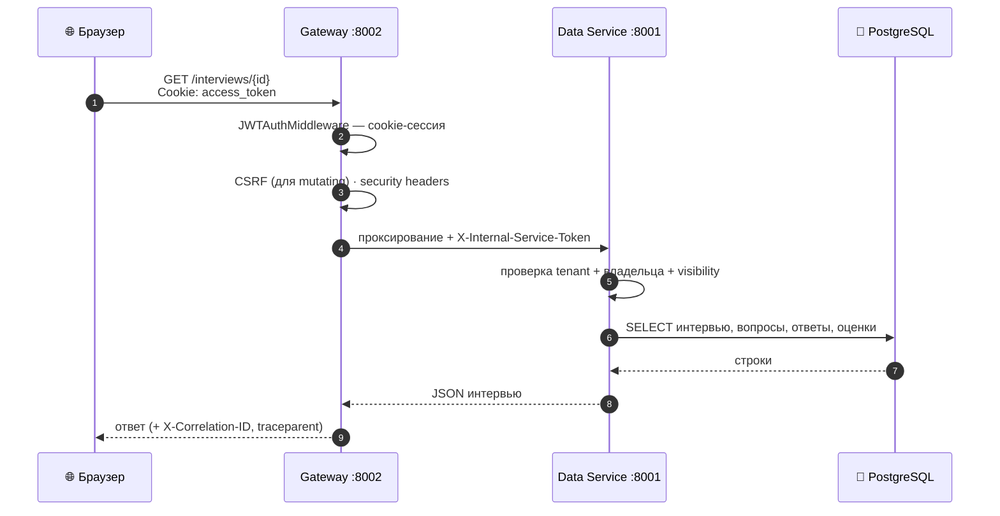
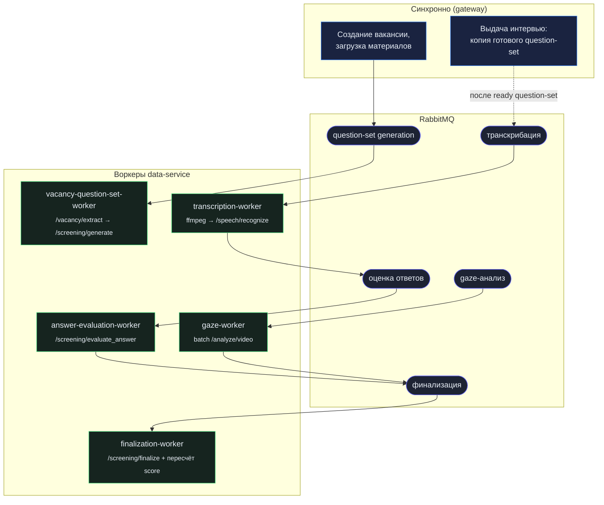
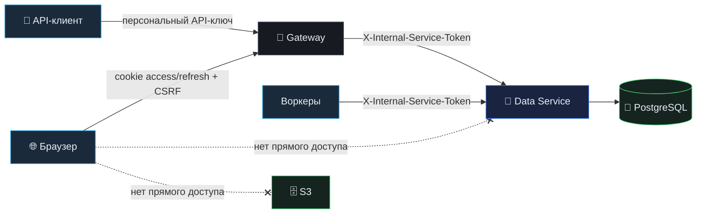

# Архитектура

Как устроена платформа и почему именно так. Дополняет обзор в [README](../README.md) деталями жизненного цикла запросов, асинхронных пайплайнов и безопасности.

---

## Сервисы

| Сервис | Порт | Наружу | Роль |
|---|---|---|---|
| `agent-hr-front` | 8080 | через nginx | React-SPA: кабинет рекрутера и кандидатский сценарий |
| `agent-hr-gateway` | 8002 | да | Единая точка входа. Авторизация, CSRF, same-origin медиа/PDF |
| `data-service` | 8001 | нет | Ядро: сущности, бизнес-логика, S3, очереди, воркеры |
| `llm-service` | 8000 | нет | Stateless AI: генерация вопросов, оценка, распознавание речи |
| `gaze-service` | 8003 | нет | Детекция взгляда: batch-анализ видео и real-time landmarks |
| `postgres` · `rabbitmq` · `minio` | — | нет | Хранилище, очереди, объектное хранилище |

Все контейнеры — во внутренней Docker-сети `agent-hr-network`. Наружу открыты только gateway и фронтенд. Корневой репозиторий — meta-repo: инфраструктура и оркестрация в нём, а сами сервисы подключены как **git submodules**, каждый с собственной историей и CI.

## Жизненный цикл запроса

Браузерный запрос за результатом интервью проходит строго через gateway; data-service из браузера не виден.



Для автоматизированных клиентов вместо cookie используется персональный API-ключ: gateway разрешает ключ через data-service и выпускает **краткоживущий внутренний JWT**, чтобы downstream-роуты работали по единому контракту, не зная про API-ключи.

## Асинхронная обработка

Тяжёлое (LLM, речь, видео) уводится в фон через RabbitMQ. Data-service публикует задачи и владеет состоянием; LLM- и gaze-сервисы остаются вычислительными узлами без состояния.



Ключевой инвариант: **question-set версионируется на уровне вакансии** и лишь копируется в интервью. Поэтому создание интервью — быстрая синхронная операция, которая проверяет наличие `ready` набора нужного размера, а не запускает генерацию по PDF в момент прохождения.

## Хранение файлов

Медиа не лежат в локальной ФС сервера. Все бинарные объекты — в S3-совместимом хранилище (AWS S3 или MinIO), data-service выступает слоем абстракции над бакетом.

```
s3://<bucket>/
  interviews/{interview_id}/answers/{answer_id}/{filename}
  interviews/{interview_id}/recordings/{upload_id}-{filename}
  vacancies/{vacancy_id}/materials/{material_id}/{filename}
```

- **Chunked upload** — большие записи грузятся по чанкам, собираются на стороне data-service, отправляются в S3, временная директория чистится.
- **Same-origin просмотр** — вместо прямого bucket-URL клиент получает `/media/{object_key}`, читаемый через gateway.
- **Очистка по префиксу** — при удалении интервью/вакансии связанные объекты удаляются по префиксам.

## Границы доверия



| Секрет | Направление | Смысл |
|---|---|---|
| cookie `access_token` | браузер → gateway | «я вошедший пользователь этого tenant'а» |
| персональный API-ключ | клиент → gateway | «я автоматизированный клиент» (hash+prefix в БД) |
| `X-Internal-Service-Token` | gateway/воркеры → data-service `/internal/*` | «вызов уже авторизован во внешнем слое» |

Публичный кандидатский контур защищён отдельно: **OTP**-подтверждение отклика, rate-limiting по email/IP, защита от повторного отклика и повторного входа в уже начатое интервью. При старте сервисы делают **fail-fast** проверку секретов и не поднимаются в production с дефолтными значениями JWT/API-key/internal-token.

## Наблюдаемость

Каждый сервис публикует метрики Prometheus и трейсы OpenTelemetry. Сквозной `X-Correlation-ID` и `traceparent` протягиваются через gateway во все внутренние вызовы и воркеры, так что путь одного запроса — от браузера до фонового воркера оценки — восстанавливается по трейсу целиком.
