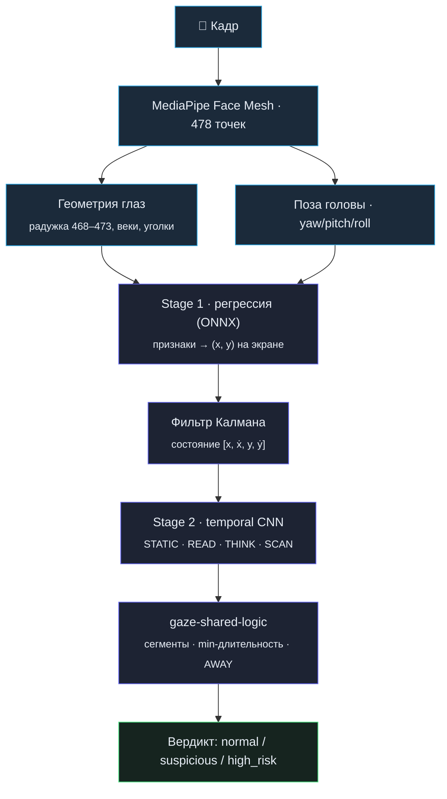

# Сервис детекции взгляда

Самая исследовательская часть платформы: по видео интервью отличить **чтение с экрана** от нормального поведения — размышления, взгляда в камеру, естественных движений глаз. Дополняет раздел [«Сервис взгляда»](../README.md#️-сервис-взгляда-детекция-списывания) в README математикой и деталями обучения.

---

## Двухэтапный пайплайн

Задача разбита на два этапа: сначала оценить **куда** смотрит человек, затем по временно́й последовательности понять, **что** он делает.



## Stage 1 — координата взгляда

**Признаки.** Из 478 точек лица берутся точки радужки (468–473), век и уголков глаз. Из них считаются: координаты центра радужки относительно центра глаза, расстояния радужка–уголки, соотношение горизонтали и вертикали, угол наклона глаза. К геометрии добавляются углы поворота головы (yaw, pitch, roll) — без них одна и та же геометрия глаз означает разные точки экрана.

**Калибровка под пользователя.** Геометрия глаз индивидуальна, поэтому перед интервью кандидат проходит калибровку: на экране последовательно появляются точки, кандидат смотрит на каждую 2–3 секунды, система записывает признаки. Координаты цели нормированы в `[0, 1]` (границы экрана), плюс намеренно добавляются **off-screen точки** в диапазоне примерно `[-0.4, 1.4]` — чтобы модель научилась различать выход взгляда за пределы экрана. На этих данных обучается персональная регрессия, которая экспортируется в **ONNX** и используется как production-модель первого этапа.

Интерфейс калибровки — это ещё и инструмент сбора размеченных данных: он синхронно показывает целевую точку, сохраняет кадры и записывает истинную координату, формируя датасет без ручной постобработки.

**Функция потерь с delta-loss.** Модель обучается с двумя компонентами:

- **основная ошибка** по положению точки взгляда — за абсолютную точность координаты;
- **delta-loss** — штраф за расхождение *изменения* предсказанных координат и *изменения* истинных между соседними примерами.

Delta-loss делает модель чувствительной к микросмещениям взгляда: она начинает реагировать на малые движения глаз, а не только на крупные переходы между областями экрана — что критично для последующей детекции чтения.

## Фильтр Калмана — сглаживание траектории

Детекция MediaPipe шумит из-за ограниченной точности сети и естественных микродвижений глаз. Для стабильной траектории применяется фильтр Калмана — оптимальная оценка состояния линейной динамической системы по зашумлённым наблюдениям.

**Постановка.** Реальный процесс:

```
Y_{t+1} = A · Y_t + U_{t+1}         (шум процесса U)
```

Наблюдения (выход MediaPipe + калибровки) искажены собственным шумом:

```
X_{t+1} = B · Y_{t+1} + W_{t+1}     (шум измерений W)
```

Шумы `U` и `W` независимы и нормальны; доступны только зашумлённые `X`, по которым восстанавливается реальное состояние `Y`.

**Модель состояния** — постоянная скорость, `[x, ẋ, y, ẏ]`:

```
     ⎡ 1  dt  0   0 ⎤              ⎡ 1  0  0  0 ⎤
 A = ⎢ 0   1  0   0 ⎥          B = ⎣ 0  0  1  0 ⎦
     ⎢ 0   0  1  dt ⎥
     ⎣ 0   0  0   1 ⎦
```

где `dt = 1/FPS ≈ 0.033 c`. Матрица `B` проецирует полное состояние на наблюдаемые координаты `(x, y)`.

**Параметры.**

- `process_noise = 0.05` — высокая уверенность в модели постоянной скорости (движения взгляда плавные);
- `measurement_noise = 10.0` — фильтр больше доверяет предсказанию, чем наблюдению.

Соотношение `measurement_noise ≫ process_noise` и обеспечивает сглаживание: дрожание координат от MediaPipe подавляется, но реальные движения взгляда остаются отслеживаемыми. Неизвестные параметры системы уточняются **EM-алгоритмом**. Реализация — класс `KalmanFilterPose` поверх `pykalman` с методами `filter(observation)` и `predict()`, обновляется на каждом кадре.

## Stage 2 — классификация поведения

По скользящему окну признаков модель решает многоклассовую задачу:

| Класс | Что означает |
|---|---|
| `STATIC` | Взгляд стабилен, нет поискового или читающего поведения |
| `READ` | Короткие горизонтальные перемещения, фиксации и возвраты — паттерн чтения |
| `THINK` | Менее структурированный взгляд — размышление без чтения внешнего текста |
| `SCAN` | Активное перемещение по областям — просмотр/поиск, но не обязательно чтение |

**Почему не LSTM.** Изначально второй этап строился на LSTM, но она слишком быстро забывала контекст на длинных последовательностях. В итоге выбрана **temporal-архитектура со свёртками**: сверточные временны́е блоки выделяют устойчивые локальные паттерны движения глаз и стабильнее работают на длинных рядах.

**Признаки чтения**, которые ловит модель:

- **саккады** — быстрые скачки между словами (50–100 мс);
- **фиксации** — остановки на словах (200–300 мс);
- **регрессии** — возвраты назад по тексту (10–15% движений);
- **линейность** — движение слева направо с переходами на новую строку вниз.

Классы `THINK` и `SCAN` специально отделяют чтение от «взгляд блуждает» и «взгляд фиксируется в раздумье» — иначе размышление принималось бы за списывание.

## Постобработка: `gaze-shared-logic`

Единый слой постобработки для production-сервиса и reviewer-инструментов. Превращает шумные покадровые вероятности в устойчивые события:

1. вероятности Stage 2 → прикладные категории;
2. близкие классы объединяются: `STATIC` → `FIXED`, `THINK` + `SCAN` → `SCAN`;
3. временна́я фильтрация и минимальная длительность сегмента — одиночные всплески не становятся событиями;
4. отдельно считается `AWAY` — долгий увод взгляда за экран;
5. на выходе — последовательность стабильных сегментов и итоговая статистика.

Этот слой критичен для снижения false positives: сеть может кратко выдать высокий `READ`/`SCAN` из-за шума landmarks, морганий или случайных движений головы, но в реальном сценарии одиночные всплески не должны читаться как подозрительное поведение.

## Real-time и batch

- **Real-time** — фронтенд считает 478 landmarks через MediaPipe WASM и шлёт их по WebSocket (15–30 FPS) через gateway; сервис отвечает с throttling 5 FPS (200 мс). Передаются именно landmarks (~10 КБ), а не кадр (~100 КБ) — на порядок меньше трафика. `SessionManager` держит на сессию свой `kalman_filter`, `gaze_tracker` (30 точек), окно `reading_inference` (60 кадров) и `result_buffer`.
- **Batch** — `POST /analyze/video`: скачать запись → извлечь кадры (15 FPS) → MediaPipe + пайплайн → батч-сохранение в data-service → summary. Статусы job: `queued` / `processing` / `completed` / `failed`. Именно batch-результат встраивается в антифрод-таймлайн интервью.

## Метрики

- **Stage 1** (регрессия координат): MAE_x = 0.054, MAE_y = 0.128 на валидации.
- **Stage 2** (классификация поведения): **F1 = 0.9215** — модель уверенно различает чтение, сканирование, статику и размышление.

## Ограничения

Освещение (чувствительность MediaPipe), очки (отражения искажают детекцию радужки), качество калибровки (требует кооперации), естественные движения глаз (возможны false positives). Направления развития — внешние датасеты (MPIIGaze, GazeCapture, RT-GENE), синтетика, transfer learning, адаптивная калибровка во время интервью и temporal-трансформеры вместо свёрток.
